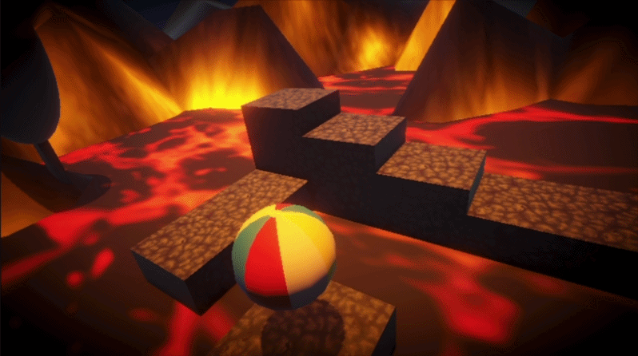

# Unity Toybox

A collection of small Unity game prototypes made to explore different game mechanics and ideas.

## Prototypes

| Prototype | Demo | Preview |
| --- | --- | --- |
| **Floor Is Lava** | [Play me!](https://play.unity.com/en/games/9056f0bf-e866-4a55-85a6-d2f5eadef156/floor-is-lava) |   |


## About this repository

Each top-level project folder is a separate Unity project and should be opened in Unity on its own.

```text
Unity-Toybox/
├── 0_FloorIsLava/       # Contains its own Assets, Packages etc..
├── 1_PrototypeName/     # Contains its own Assets, Packages etc..
├── etc..
├── README.md
└── .gitignore
```


The current prototypes are built with Unity `6000.5.6f1` and is recommended to use this version (or compatible ones) to test them on the editor.